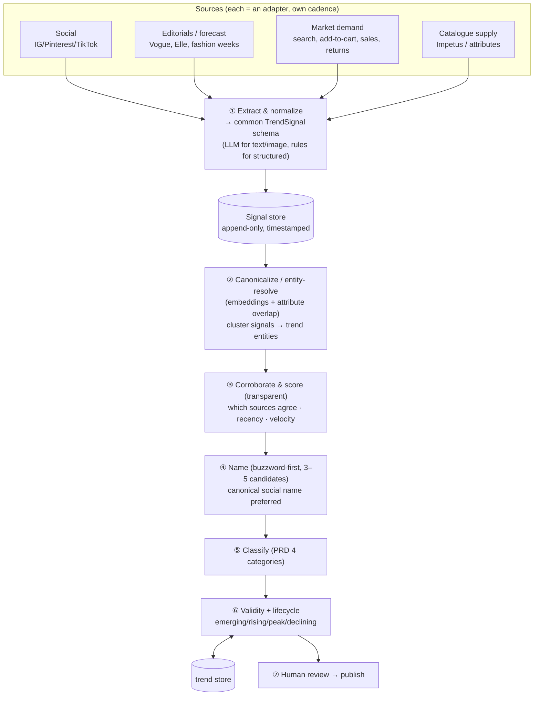

# Best-Solution Plan — Multi-Source Trend Generation

Scope: trend GENERATION only (trend→catalogue/product mapping stays with the other
team; no product-mapping built here). The question: if inputs are not just Impetus
but **social signals, market demand, editorials** (and catalogue as one more
signal), is the current design best — and what is?

---

## Verdict on the current design

The current pipeline is **Impetus-centric**: it treats one structured source as the
spine, clusters/names it, and bolts on a single Google-Search "grounding" call as a
stand-in for social. That's a fine MVP for one structured source. It is **not** the
best shape once you have several real raw feeds, because it lacks the three things
that actually matter in a multi-source world:

1. **Per-source ingestion/normalization** — a grounding call can't ingest a Pinterest
   trending feed, a Vogue RSS, or a demand table. Each source has its own shape,
   cadence, noise, and reliability.
2. **Cross-source corroboration** — the core value of many sources is *agreement*:
   a trend editorial predicts, social is buzzing about, and demand is rising on, is
   far more trustworthy than a lone LLM guess. The current design can't corroborate.
3. **Entity resolution** — the same trend appears under different names in each
   source ("Korean Pants" / "wide-leg" / "barrel jeans"). Current dedup is exact-slug
   — far too weak to fuse sources.

So: **evolve, don't discard.** The agent steps (extraction, naming, classification),
Gemini structured/grounded calls, Langfuse, the 4-category taxonomy, buzzword-first
naming, and the trend store are all reusable. The reframe is adding an **ingestion +
normalization + canonicalization + corroboration** front-end and making each source
first-class.

---

## The best shape: a signal-fusion engine

Treat a trend as an **evidence-backed entity fused from many signals**, not as a
cluster of catalogue rows.



### Canonical `TrendSignal` schema (every source normalizes to this)
```
source            social_instagram | editorial_vogue | market_demand | catalogue_impetus | llm_calendar
captured_at       timestamp
trend_phrase      raw phrase as the source names it (e.g. "barrel-leg jeans")
implied_attrs     {silhouette, colour, fabric, fit, garment, ...}
category_hint     attribute_driven | occasion_festival | event_driven | functional
strength          source-native volume/intensity (hashtag count, article count, demand Δ, catalogue count)
evidence          url / snippet / record id
```

### Signal roles (why each source matters)
| Source | Role in a trend |
|---|---|
| **Editorials / fashion weeks** | *Leading* signal — what will trend; authority/forecast |
| **Social** | *Recognition + virality* — what IS trending and the customer-facing NAME |
| **Market demand** (internal) | *Validation* — real purchase intent, not just chatter |
| **Catalogue (Impetus)** | *Availability* — supply signal (mapping itself is the other team's job) |

A high-quality trend ideally shows **editorial + social + demand** alignment; the
corroboration step makes that explicit and explainable (lists the evidence, not a
magic number).

---

## Phased plan

**Phase 0 — Refactor to source-agnostic (low risk, high leverage)**
- Define the `TrendSignal` schema + a `SourceAdapter` interface.
- Wrap today's Impetus path as the first adapter (`catalogue_impetus`) and the
  grounding call as a `social_grounding` adapter. No behaviour change, but the spine
  becomes pluggable.

**Phase 1 — Add real sources as adapters**
- **Editorials**: RSS/sitemize Vogue/Elle India + fashion-week recaps → LLM extract
  TrendSignals (lead signal). Cheapest real source to add.
- **Market demand**: ingest internal search queries / add-to-cart / sales deltas →
  deterministic TrendSignals (strongest validation; needs data access).
- **Social**: real volume via a social-listening API or a curated crawler
  (Instagram/Pinterest) — the maintained version of today's grounding.

**Phase 2 — Fusion core**
- **Entity resolution**: embed `trend_phrase + implied_attrs`; cluster signals into
  trend entities (replaces slug dedup). Vector store.
- **Corroboration & transparent scoring**: per entity, record corroborating sources,
  recency, and velocity (rising/falling) — an evidence list + simple, explainable
  strength tier (e.g. "3 sources, rising 2 wks").

**Phase 3 — Lifecycle, refresh, review**
- Per-source cadence (social ~daily, demand ~daily, editorial ~weekly, catalogue
  ~monthly); scheduled fusion run.
- Lifecycle from velocity across runs; expiry by validity window.
- Review/publish workflow + a CTR feedback loop that learns which name styles win.

**Phase 4 — Beyond text**
- **Multimodal**: embed catalogue/editorial *images* (Gemini is multimodal) to catch
  looks the attribute tags miss; cluster visually.

---

## What carries over (reuse, don't rebuild)
- Gemini structured/grounded helpers (`llm.py`), retry, Langfuse tracing.
- Naming layer (buzzword-first, 3–5 candidates), PRD 4-category classifier.
- `postprocess.py` (momentum/validity/review) and the persisted trend store —
  generalise momentum to cross-source velocity.
- LangGraph still fits the *reasoning* stages (extract → resolve → corroborate →
  name → classify); ingestion/scheduling sits outside it.

## Key decisions / asks
- **Source access**: which social API / crawler (cost, ToS, maintenance); access to
  internal demand data (the single most valuable signal); editorial source list.
- **Vendor vs build** for social listening.
- **Refresh cadence** per source and the fusion window.
- **Where corroboration evidence lives** (signal store + vector index choice).

## One-line verdict
Current design = solid single-source MVP. Best design for multi-source = a
**signal-fusion engine**: per-source adapters → normalize → entity-resolve →
corroborate → name → classify → lifecycle. It *reuses* most of what's built; the new
weight is ingestion + fusion, and the payoff is trends that are trustworthy because
multiple independent signals agree.
