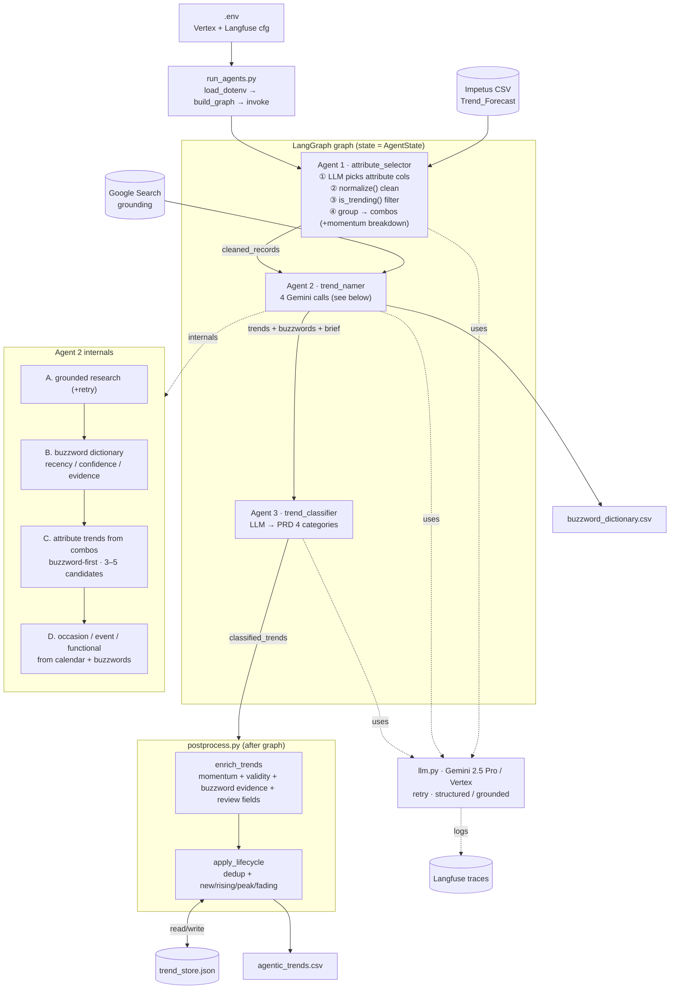

# Trend Generation — Code Flow

Agentic system (`run_agents.py`). LangGraph 3-agent graph on Gemini 2.5 Pro
(Vertex AI), traced in Langfuse, with generation-side post-processing.

## Mermaid



## ASCII (fallback)

```
.env ─┐
      ▼
Impetus CSV ─► run_agents.py ─► graph.invoke(AgentState)
                                     │
  ┌──────────────────────────────────┴──────────────────────────────────┐
  │ LangGraph                                                             │
  │  Agent 1  attribute_selector                                          │
  │   read CSV → LLM pick attr cols → normalize → is_trending → combos    │
  │      │ cleaned_records (+ momentum breakdown per combo)               │
  │      ▼                                                                │
  │  Agent 2  trend_namer        ◄── Google Search grounding              │
  │   A grounded research  →  B buzzword dict  →  C attribute trends       │
  │                                          →  D occasion/event/functional│
  │      │ trends + buzzwords + brief                                     │
  │      ▼                                                                │
  │  Agent 3  trend_classifier  → PRD 4 categories                        │
  └──────────────────────────────────┬──────────────────────────────────┘
                                      │ classified_trends
                                      ▼
                 postprocess.py:  enrich_trends (momentum/validity/
                                  review/buzzword evidence)
                                  → apply_lifecycle (dedup + lifecycle) ⇄ trend_store.json
                                      │
                                      ▼
                 outputs:  agentic_trends.csv   buzzword_dictionary.csv

  cross-cutting:  llm.py (Gemini/Vertex, retry) ──logs──► Langfuse
```

## PRD source mapping

| Step | PRD source |
|---|---|
| Agent 1 + Agent 2·C (attribute trends) | §6.1 Impetus |
| Agent 2·D (occasion/event/functional)  | §6.2 LLM querying |
| Agent 2·A/B (grounded research → buzzwords) | §6.3 Social crawl (approx.) |
| Agent 3 | §3 Taxonomy |
| postprocess (naming review, validity, momentum) | §4 / §8.6 / §8.7 |
